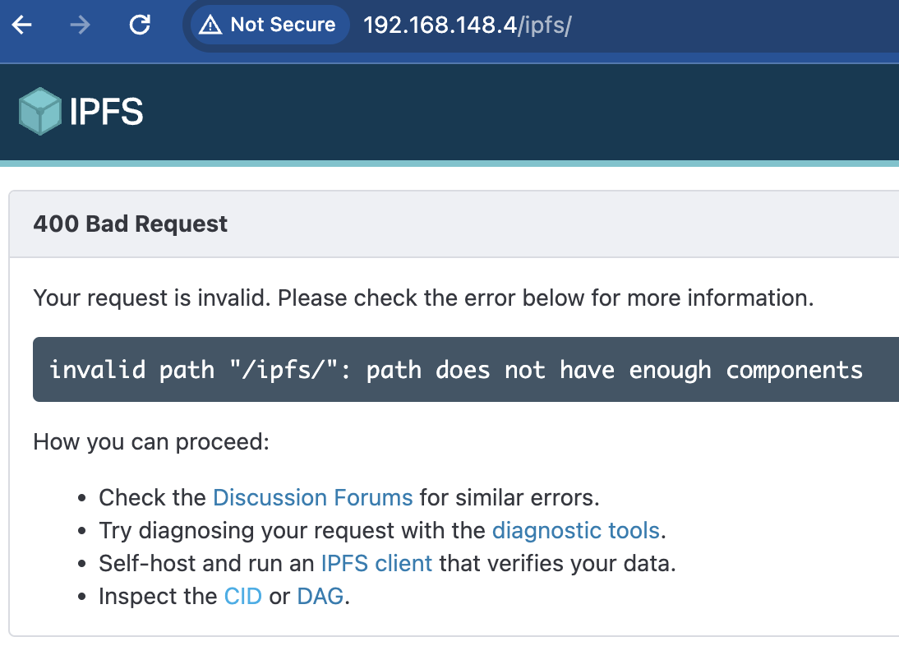

# Private IPFS Cluster for Data Replication

This repository provides a comprehensive guide and setup for building a private IPFS (InterPlanetary File System) cluster designed for secure and efficient data replication. Inspired by the insightful work at [Eleks Research](https://eleks.com/research/ipfs-network-data-replication/), this repository covers the creation of a IPFS Swarm network, joining nodes to the swarm, configuring IPFS, and establishing a robust private network for enhanced data replication and distribution.

## Key Features:

- **IPFS Swarm Integration**: Initiate and manage a IPFS Swarm network to orchestrate IPFS nodes for improved collaboration and resource utilization.

- **Cross-Platform Compatibility**: Utilize Alpine Linux and ARM64 architecture for a lightweight and efficient containerized environment.

- **IPFS Configuration**: Configure IPFS nodes for private access, adjusting addresses, and generating the necessary swarm key for secure communication.

- **Bootstrapping IPFS Nodes**: Learn the essentials of bootstrapping IPFS nodes, ensuring efficient communication and replication within the private cluster.

- **Service Management**: Implement service management with OpenRC in Alpine Linux, converting from a systemd service to an OpenRC service.

- **Testing and Usage**: Verify the functionality of your private IPFS network by testing access to Content Identifiers (CIDs) and ensuring smooth data replication.

## Usage:

1.  **Prepare common files**:

    ```bash
    chmod +x ./prepare.sh
    ./prepare.sh
    ```

    This will create the necessary directories and files for the manager/worker docker image.

2.  **Setup Swarm IPFS**:

    - Follow the instructions in [run-guide](./RUN-GUIDE.md) for initializing the IPFS Swarm network.

3.  **Check**:

    We can go open docker container terminal with `docker exec -it <container> /bin/sh` command, then we can test the IPFS with the following commands:

    Make sure all necessary files are in place:

    ```bash
      ls -a
      ls /vol/swarm -a
    ```

    Check the IPFS configuration:

    ```bash
    cat ~/.ipfs/swarm.key
    cat ~/.ipfs/config
    ```

    Check the IPFS Daemon service status:

    ```bash
    cat etc/init.d/ipfs
    rc-status -a
    rc-service ipfs status
    ```

    Check swarm network:

    ```bash
    ipfs bootstrap
    ipfs swarm peers
    ```

    > Make sure if the IPFS Daemon is running. If not, we can start it manually for each node with `rc-service ipfs start` command.

4.  **Testing**:

    You can test the IPFS with the following commands:

    ```bash
    ipfs add -r /vol/swarm
    ipfs pin ls -t recursive
    ipfs pin rm -r <cid>
    ipfs repo gc
    ```

    Test the IPFS Gateway with the following command:

    ```bash
    curl http://<node_ip_address>:8080/ipfs/<cid>
    ```

    <!-- image preview-1.1.png -->

    
    

    Also we can test upload/add file via api server with the following:

    ```bash
    curl -X POST -F file=@/path/to/your/file http://<node_ip_address>:5001/api/v0/add
    ```

This docs is not complete yet.
